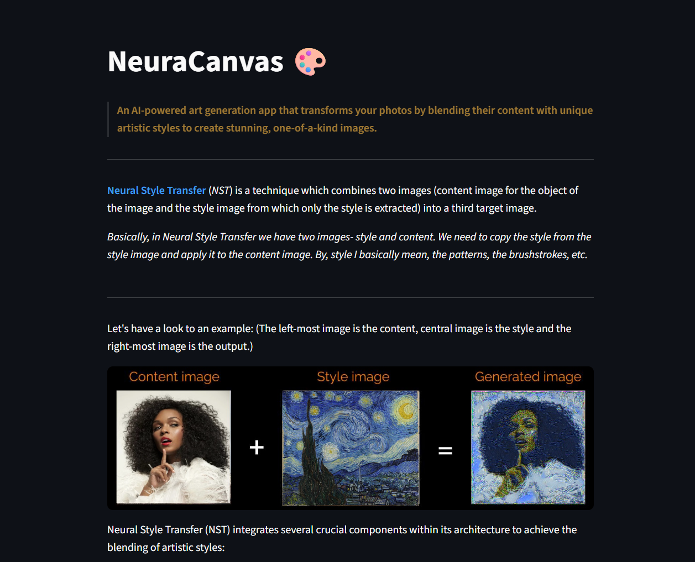

# NeuraCanvas - AI Powered Art Generation App 🎨

> An AI-powered art generation app that transforms your photos by blending their content with unique artistic styles to create stunning, one-of-a-kind images.


## 📖 Overview

**Neural Style Transfer** *(NST)* is a technique which combines two images (`content image` for the object of the image and the `style image` from which only the style is extracted) into a third `target image`.

Basically, in Neural Style Transfer we have two images- style and content. We need to copy the style from the style image and apply it to the content image. By, style I basically mean, the patterns, the brushstrokes, etc.

> [!NOTE]  
> Want to know more about the NST Paper? Check out this repo here: [NeuStyle](https://github.com/aman-chhetri/neu-style)

*Let's have a look to an example below: (The left-most image is the content, central image is the style and the right-most image is the output.)*

<!-- <p align="center">

</p> -->
<p align="center">

</p>

You can check out the deployed app here: [NeuraCanvas](https://neura-canvas.streamlit.app/)

<!-- ## Installation with conda

These instructions assume that [Anaconda](https://www.anaconda.com/products/individual) or [Miniconda](https://docs.conda.io/en/latest/miniconda.html) are installed in the computer.

1. Open Anaconda Prompt and clone this repository in the desired path, and enter to it:
   ```Shell
   cd <your_custom_directory_name>
   git clone https://github.com/javiertg9/neural-style-transfer-app
   cd neural-style-transfer-app
   ```
2. Create the environment with the needed dependencies with the provided `environment.yaml` file of this repo:
   ```Shell
   conda env create -f environment.yml
   ```
3. Activate the environment:
   ```Shell
   conda activate nst-app
   ``` -->

## 🚀 Getting Started

Clone the repository and install the required dependencies using the following commands:

```bash
git clone https://github.com/aman-chhetri/NeuraCanvas.git
```

```bash
cd NeuraCanvas
```

```bash
pip install -r requirements.txt
```
   
```bash
streamlit run app.py
```

Then, your default browser (localhost) should open the following page:
<p align="center">

</p>


### Steps to run the app:
 
* Go to sidebar dropdown and choose option `"Click here to run app!"`. 
* After that `upload` the content and style images respecctively. 
* Then after that click `"START"` button to start the model. 
* After a while around 40-50 secs, you can see the `generated images`.

*If the image looks unoptimized, try increasing iterations number (or tune the weights of the loss function).*

## 👏 Acknowledgements

These are some of the resources I referred to while working on this project. You might want to check them out.

* The original paper on neural style transfer by [Gatys et al](https://www.cv-foundation.org/openaccess/content_cvpr_2016/papers/Gatys_Image_Style_Transfer_CVPR_2016_paper.pdf) .
* PyTorch's [tutorial on NST](https://pytorch.org/tutorials/advanced/neural_style_tutorial.html).
* The original paper on [VGG19](https://arxiv.org/abs/1409.1556).

I found these repos useful: (while implementing the model)

* [fast_neural_style](https://github.com/pytorch/examples/tree/master/fast_neural_style) (PyTorch, feed-forward method)
* [neural-style-tf](https://github.com/cysmith/neural-style-tf/) (TensorFlow, optimization method)
* [neural-style](https://github.com/anishathalye/neural-style/) (TensorFlow, optimization method)


I found some of the content/style images from here:

* [Rawpixel](https://www.rawpixel.com/board/537381/vincent-van-gogh-free-original-public-domain-paintings?sort=curated&mode=shop&page=1)
* [Wikimedia](https://commons.wikimedia.org/wiki/Category:Images)
* [Unsplash](https://unsplash.com/)
* [Pexels](https://www.pexels.com/)

## 🤝 Feedback and Contribution

It is publicly open for any contribution. Bugfixes, new features, and extra modules are welcome.

- To contribute to code: Fork the repo, push your changes to your fork, and submit a pull request.
- To report a bug: If something does not work, please report it using [GitHub Issues](https://github.com/aman-chhetri/NeuraCanvas/issues).


## 📬 Connect

- Email: chhetryaman3@gmail.com
- X: [@amanxtwts](https://x.com/amanxtwts) 
- Website: [Portfolio](https://amankshetri.com.np)
- LinkedIn: [@amankshetri](https://linkedin.com/in/amankshetri)

<div align="center">© 2025 Aman Kshetri 👨‍💻</div>